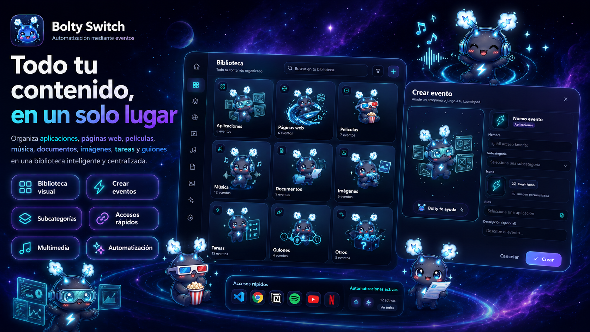
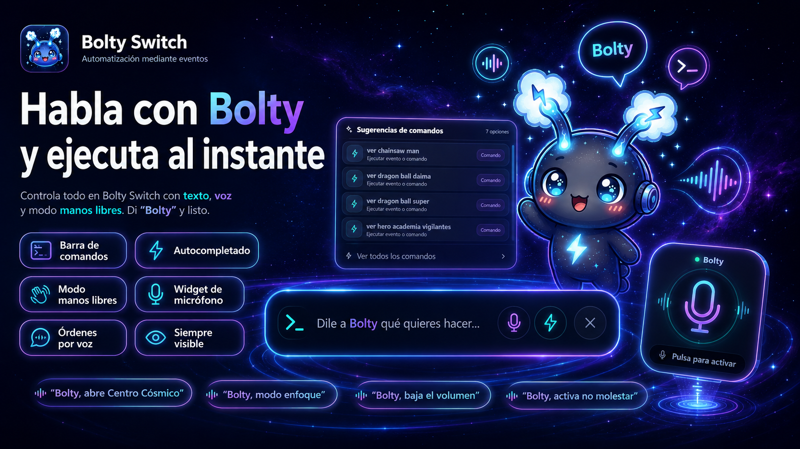
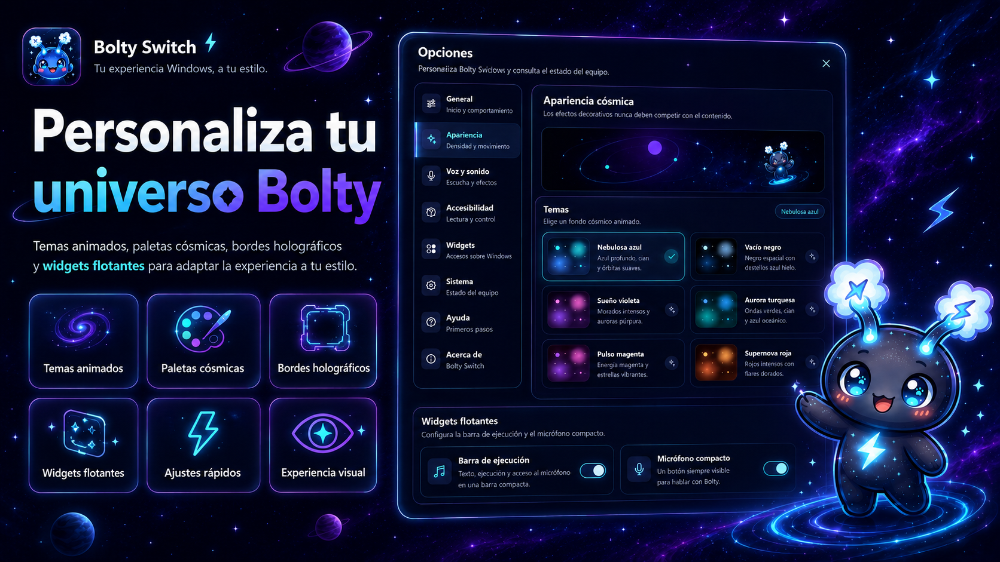
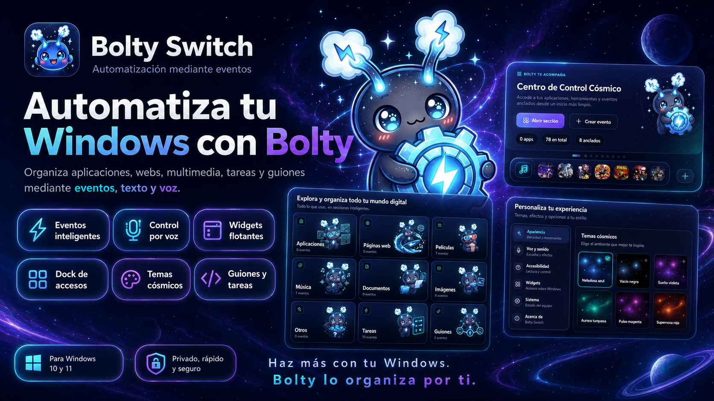
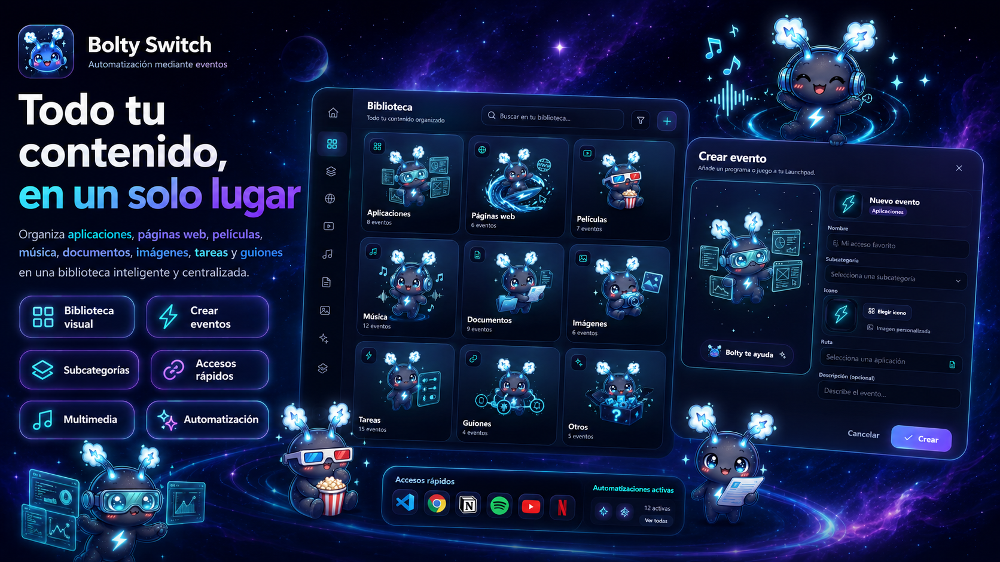
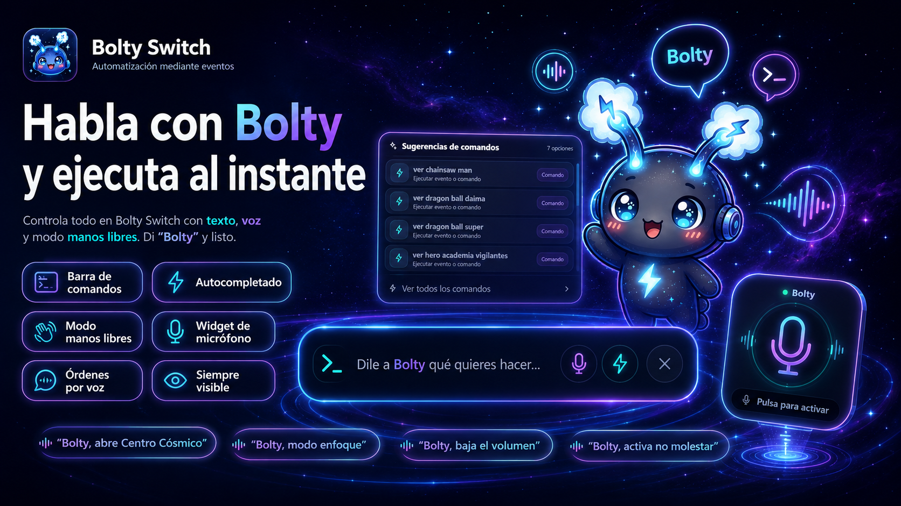
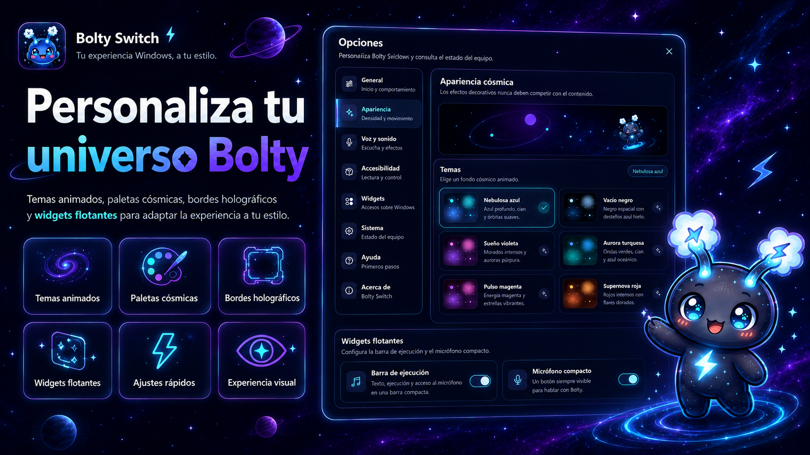

<div align="center">
  
  <h1>⚡ Bolty Switch</h1>
  <p><strong>Automatización mediante eventos para Windows</strong></p>
  <p>
    Organiza tu contenido, ejecuta acciones por texto o voz y personaliza tu experiencia
    con una interfaz cósmica, kawaii y moderna creada por <strong>Zazen AI Studio</strong>.
  </p>

  <p>
    
    
    
    
  </p>

  <p>
    
    
    
  </p>
</div>

---

## 🌌 Vista general

<p align="center">
  
</p>

**Bolty Switch** es una aplicación de automatización para **Windows 10 y 11** que convierte tu escritorio en un centro de control inteligente. Permite organizar aplicaciones, webs, contenido multimedia, documentos, tareas y guiones dentro de una biblioteca visual unificada, con acceso por **clic, texto y voz**.

La experiencia visual está diseñada con una identidad **cósmica, kawaii y futurista**, protagonizada por **Bolty**, la mascota oficial del proyecto.

---

## ✨ Qué hace Bolty Switch

- ⚡ **Automatiza acciones mediante eventos**.
- 🗂️ **Organiza tu contenido por categorías** dentro de una biblioteca visual.
- 🎙️ **Controla el sistema por voz** con barra de comandos, autocompletado y manos libres.
- 🧩 **Usa widgets flotantes** para acceder rápidamente a funciones clave.
- 🎨 **Personaliza la experiencia** con temas cósmicos, paletas animadas y bordes holográficos.
- 🧠 **Centraliza tu flujo de trabajo** en una sola interfaz moderna y limpia.

---

## 🪐 Características principales

### 📚 Biblioteca inteligente

<p align="center">
  
</p>

Bolty Switch organiza tu contenido en categorías visuales y accesibles:

- **Aplicaciones**
- **Páginas web**
- **Películas y series**
- **Música**
- **Documentos**
- **Imágenes**
- **Tareas del sistema**
- **Guiones**
- **Otros accesos**

Cada categoría puede contener eventos, subcategorías y accesos personalizados, todo con una presentación visual coherente y amigable.

---

### 🎤 Control por texto, voz y modo manos libres

<p align="center">
  
</p>

Bolty Switch integra una experiencia de control conversacional enfocada a productividad:

- **Barra de comandos** con autocompletado.
- **Sugerencias inteligentes** mientras escribes.
- **Órdenes por voz** mediante micrófono.
- **Modo manos libres** con palabra de activación **“Bolty”**.
- **Widget de micrófono** siempre visible para acceso rápido.
- **Señales visuales y sonoras** para confirmar escucha y activación.

Ejemplos de uso:

- `Bolty, abre Centro Cósmico`
- `Bolty, baja el volumen`
- `Bolty, activa no molestar`
- `Bolty, abre Visual Studio Code`

---

### 🎨 Temas, apariencia y estilo cósmico

<p align="center">
  
</p>

La interfaz puede personalizarse con:

- **Fondos animados cósmicos**.
- **Paletas visuales** azul, negra, morada y variantes.
- **Bordes holográficos animados**.
- **Widgets flotantes** con diseño futurista.
- **Opciones de accesibilidad y control visual**.

---

## 🚀 Funcionalidades destacadas

<div align="center">

| Función | Descripción |
|---|---|
| ⚡ **Eventos inteligentes** | Ejecuta aplicaciones, abre webs, carga archivos y automatiza acciones. |
| 🧠 **Biblioteca visual** | Todo tu contenido en una sola interfaz organizada. |
| 🎙️ **Control por voz** | Ejecuta órdenes hablando con Bolty. |
| 🧪 **Widgets flotantes** | Barra de ejecución y micrófono compacto siempre accesibles. |
| 🌌 **Temas cósmicos** | Personaliza la apariencia con fondos y efectos visuales. |
| 🧾 **Guiones y tareas** | Encadena acciones o usa tareas internas del sistema. |
| 📌 **Dock de accesos** | Accesos anclados para abrir eventos rápidamente. |
| 💾 **Persistencia local** | Base de datos local para guardar contenido y ajustes. |

</div>

---

## 🖼️ Capturas promocionales

<p align="center">
  
  
</p>
<p align="center">
  
  
</p>

> 💡 **Sugerencia:** guarda las imágenes promocionales del README dentro de `assets/readme/` para mantener el repositorio limpio y facilitar su reutilización en GitHub, documentación o Microsoft Store.

---

## 🧰 Tecnologías utilizadas

### Frontend
- **Tauri 2**
- **React**
- **TypeScript**
- **Framer Motion**

### Backend
- **Python**
- **SQLite**
- **Vosk** (reconocimiento de voz local)

### Distribución
- **NSIS** (`.exe`)
- **WiX** (`.msi`)
- **GitHub Actions** para compilación y publicación automática

---

## 📦 Instalación

### Descargar versión ya compilada
En **GitHub Releases**, descarga uno de estos instaladores:

```text
Bolty-Switch-*_x64-setup.exe
Bolty-Switch-*.msi
```

Instala y ejecuta el programa como una aplicación normal de Windows.

---

## 🛠️ Compilación local

### Requisitos

- Windows 10 u 11 de 64 bits
- Python 3.11, 3.12 o 3.13
- Node.js 22 LTS
- Rust estable con toolchain MSVC
- Visual Studio Build Tools con **Desktop development with C++**
- Microsoft Edge WebView2 Runtime

### Preparación

```bat
scripts\setup_tauri_windows.bat
```

### Ejecutar en desarrollo

```bat
scripts\run_tauri_dev.bat
```

### Generar instaladores

```bat
BUILD_EXE.bat
```

Los resultados compilados se generan en rutas como:

```text
release\Bolty-Switch-v0.6.6\
frontend\src-tauri\target\release\bundle\
```

---

## 🧪 Pruebas

```bat
.venv\Scripts\python -m pytest -q
scripts\test_tasks_windows.bat
scripts\test_ipc.bat
```

---

## 🗂️ Estructura del proyecto

```text
Bolty-Switch/
├─ .github/workflows/      # compilación y publicación automática
├─ backend/                # servidor IPC y reconocimiento de voz
├─ bolty_switch/           # dominio, base de datos y tareas de Windows
├─ frontend/               # interfaz Tauri + React + TypeScript
├─ models/                 # modelos e instrucciones de voz
├─ scripts/                # utilidades de desarrollo y build
├─ tests/                  # pruebas automatizadas
├─ docs/                   # documentación técnica
├─ assets/readme/          # imágenes promocionales para GitHub
├─ BUILD_EXE.bat           # compilación local del proyecto
├─ LICENSE
└─ README.md
```

---

## 🔐 Licencia y uso

Este proyecto se publica bajo la licencia personalizada de **Zazen AI Studio**.

### Resumen importante

- ✅ Se permite el **uso personal, educativo e interno**.
- ✅ Puede instalarse en dispositivos Windows controlados por el usuario.
- ❌ **No se permite vender, redistribuir, sublicenciar ni republicar** el software.
- ❌ **No se permite reutilizar** la marca, personajes, imágenes, logos, sonidos ni la identidad visual del proyecto sin autorización expresa.
- ❌ **No se permiten versiones derivadas públicas o redistribuidas** sin permiso previo por escrito.

Lee el texto completo en [`LICENSE`](LICENSE).

---

## 👤 Autor

<div align="center">
  
  <h3>Zazen AI Studio</h3>
  <p>Proyecto creado y mantenido por <strong>Samuel Acosta Fernández</strong>.</p>
</div>

---

## 💙 Identidad del proyecto

**Bolty Switch** no es solo una herramienta de automatización: es una experiencia visual y funcional pensada para que **Windows se sienta más personal, más bonito y más inteligente**.

Si te gusta el proyecto, puedes apoyarlo de estas formas:

- ⭐ Darle estrella al repositorio
- 🌀 Compartir el proyecto mediante su repositorio oficial
- 🛠️ Reportar bugs o sugerir mejoras

---

<div align="center">
  
  <p><strong>Haz más con tu Windows. Bolty lo organiza por ti.</strong></p>
</div>
